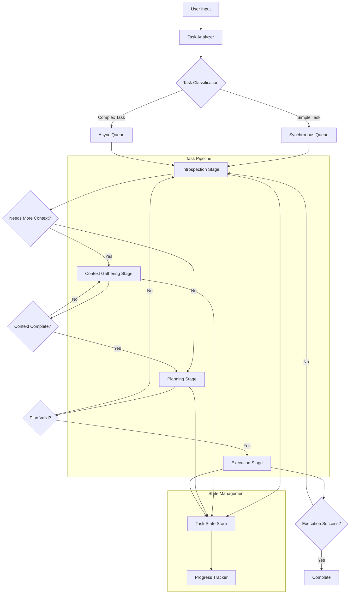

Lets write specifications of phase 3.1 of development plan together before implementation. You will find useful information following to help. Ask question for clarification if required. The scope of this task now is limited to explore and find the best approach to design the task manager considering the entire system requirments. When we both agree on the choosed approach, then will iterate to write specfications before moving to impelemtaiton.

Project Documentation: Task-Based Conversation Application with LLM, Voice Interaction, and Autonomous Task Planning

## Overview

This project aims to create an advanced task-based conversation application supporting multi-turn, vocal and text-based interactions with a large language model (LLM). The system will enable the LLM to introspectively analyze tasks, autonomously access external systems (such as filesystems, databases, and Git repositories), and actively gather necessary information before planning and executing complex tasks. A trust and approval mechanism will allow for varying levels of human oversight during the task execution process, enhancing the system's learning capabilities and adapting to user preferences. A memory or knowledge graph will facilitate the system's ability to learn from past interactions, mistakes, and user feedback, enabling it to evolve and improve over time. Additionally, an **Expectation Manager** will provide the LLM with a structured way to set its expectations during interactions, allowing it to be more proactive and nuanced in conversations.

## Requirements

### Functional Requirements

1. **Task Management System**
   - Implement a task manager to handle various types of tasks, including introspective analysis, context gathering, task planning, and task execution.
   - All tasks should follow a structured pipeline, with dynamic prioritization and dependencies.
   - Support for synchronous (stack-based) and asynchronous (concurrent) task queues to allow flexible task handling.

2. **LLM with Introspection and Chain-of-Thought Reasoning**
   - Integrate an LLM with chain-of-thought reasoning capabilities, enabling introspective analysis of task requirements.
   - **Introspection Stage**: The LLM should be able to "think" through tasks, analyzing the requirements, identifying gaps in information, and planning what additional context or dependencies it needs to gather.
   - **Context-Gathering Stage**: After introspection, the LLM should autonomously gather the necessary information from external systems.
     - Example: Read files, analyze code dependencies, query a database, or retrieve relevant project documentation.
   - **Action Planning Stage**: Once enough information is gathered, the LLM should then proceed to generate a detailed task plan with specific, actionable steps.

3. **Autonomous Task Execution with Feedback Loop**
   - After the LLM has gathered context and planned the task, it should execute the task and analyze the results.
   - If the execution reveals new information or additional dependencies, the LLM should use a **Feedback and Reiteration Stage** to re-enter the introspection phase.
   - The system should allow for iterative refinement and context augmentation to handle complex, multi-layered tasks that may need adjustment mid-execution.

4. **Conversation Interface with Voice and Text Support**
   - Implement a conversation interface with Next.js 15 and React 19, supporting both vocal and text-based interaction.
     - **Voice Input**: Use the Web Speech API for speech-to-text, allowing spoken input from the user.
     - **Voice Output**: Use TTS (Text-to-Speech) for vocal responses, allowing the system to "speak" to the user.
   - Maintain interaction history across sessions, providing continuity and context retention for long-term task progress.

5. **External System Access for Context Gathering**
   - Integrate system access that the LLM can use to autonomously retrieve required information, including:
     - **File Access**: Read files for relevant data or code.
     - **Git Repository Access**: Inspect codebases, track dependencies, or identify recent changes.
     - **Database Access**: Query necessary information from databases, e.g., project details, user information, or code snippets.
   - These resources should be accessible through API calls or local resource handlers, allowing the LLM to obtain context and dependencies for accurate task execution.

6. **Trust and Approval Mechanism**
   - Implement a trust and approval mechanism that defines varying levels of autonomy for the LLM based on user trust.
   - **Trust Levels**:
     - **Fully Trusted**: The system operates autonomously, executing tasks from discussion requirements to final delivery without human intervention.
     - **Partially Trusted**: The system requires human approval at critical stages (e.g., after planning or before execution) to enhance accuracy.
     - **Low Trust**: The system operates with significant human oversight, requiring explicit approval at each stage (introspection, context gathering, planning, and execution).
   - As the system learns user preferences and improves its accuracy, it can transition from lower to higher trust levels, gradually increasing autonomy.

7. **Memory or Knowledge Graph**
   - Integrate a memory or knowledge graph to store past interactions, decisions, and user feedback, allowing the system to learn and adapt over time.
   - The knowledge graph should facilitate:
     - **Contextual Learning**: The system can reference previous tasks and their outcomes, allowing it to improve task execution based on historical data.
     - **Error Correction**: The ability to recognize and learn from past mistakes, refining processes and approaches in future tasks.
     - **Augmented Context Generation**: By leveraging stored knowledge, the LLM can generate more relevant and informed responses based on accumulated context and user preferences.

8. **Expectation Manager**
   - Implement an expectation manager to allow the LLM to set and manage its own expectations during conversations and task execution.
   - The expectation manager should:
     - **Expectation Setting**: Enable the LLM to define what information or responses it needs from the user to progress in the workflow.
     - **Synchronous Clarification Tasks**: Create tasks that prompt the user for required information when automatic context gathering is insufficient, effectively communicating the LLM's needs.
     - **Expectation Tracking**: Monitor the progress of expected responses and actions, ensuring that the LLM can maintain focus on obtaining necessary information to advance tasks.
     - **Timeout Management**: Introduce reasonable timeouts to mimic human conversation dynamics, allowing the LLM to reiterate or follow up if the expected response is not received within a set timeframe.
     - **Proactive Engagement**: Equip the LLM to actively engage users by following up on outstanding questions or unmet expectations, ensuring that it remains effective and responsive throughout the interaction.

### Non-Functional Requirements

1. **Scalability**
   - Design a modular system to support additional task types and external resources as needed.
   - Ensure flexibility for new, complex workflows that may require multiple introspection and execution cycles.

2. **Modularity and Extensibility**
   - Keep the architecture modular to allow isolated development, testing, and replacement of specific components, such as the LLM integration layer and task manager.

3. **Maintainability and Efficiency**
   - Ensure task execution is efficient, minimizing latency in task feedback to the user.
   - Design the system for single-developer manageability, with clear structure and separation of task types.

## System Architecture

### High-Level Architecture

The architecture consists of the following key components:

1. **Conversation Interface (Next.js with React)**
   - Built with Next.js 15 and React 19 to enable a seamless, multi-turn conversation experience.
   - Uses Server Actions to execute Node.js tasks directly.
   - Supports voice and text interactions through the Web Speech API, allowing natural and flexible communication.

2. **Task Manager with Introspection, Context Gathering, and Execution Pipelines**
   - Manages task scheduling, introspection, context gathering, action planning, and task execution.
   - Includes two task queues:
     - **Synchronous Queue**: Executes tasks sequentially, managing dependencies.
     - **Concurrent Queue**: Executes tasks in parallel for non-blocking operations.
   - **Feedback and Reiteration Loop**: Allows tasks to revisit introspection and context-gathering stages based on execution outcomes.

3. **LLM Integration Layer with Chain-of-Thought Reasoning**
   - Interfaces with the LLM API, using chain-of-thought prompts for introspective analysis.
   - Provides task-specific prompt templates across phases (introspection, context gathering, action planning, execution).
   - Enables the LLM to analyze tasks, identify gaps, and create structured prompts to gather dependencies.

4. **External System Access (Filesystem, Git, Database)**
   - Provides interfaces for accessing data from external resources essential for task completion.
   - Facilitates autonomous information retrieval to support the LLM’s task planning and reasoning.

5. **Trust and Approval Mechanism**
   - Manages user trust levels, controlling the autonomy granted to the LLM during task execution.
   - Adjusts trust dynamically based on user feedback and system performance.

6. **Memory and Knowledge Graph**
   - Stores data from past interactions, decisions, and feedback to support contextual learning.
   - Enhances context generation, enabling improved task execution and user experience.
   - Features semantic search for efficient retrieval of relevant information.

7. **Expectation Manager**
   - Manages the LLM’s expectations during tasks, setting anticipated responses and tracking user interaction.
   - Provides proactive engagement by following up on delayed responses, enhancing conversational flow and effectiveness.

### Detailed Components

#### 1. Conversational Interface
   - **Voice and Text Interaction**: Enables flexible communication via voice or text.
   - **Vocal Discussion**: Facilitates natural interactions through spoken responses.

#### 2. Task Management System
   - **Synchronous Queue**: Manages tasks in a defined sequence to handle dependencies.
   - **Concurrent Queue**: Allows non-blocking, concurrent task processing for efficiency.

#### 3. Intention-Based Routing
   - **Routing by Intention**: Detects user intentions and routes to appropriate workflows, such as refactoring discussions, feature creation, or brainstorming.
   - **Workflow Context Preservation**: Maintains context across interactions, enabling smooth transitions between workflows.

#### 4. Feedback Mechanisms
   - **User Feedback Loops**: Allows users to provide feedback, refining system accuracy and user satisfaction.
   - **Contextual Reminders**: Sends reminders for pending tasks or follow-ups based on past interactions.

#### 5. Advanced Memory and Knowledge Graph
   - **Dynamic Memory Updates**: Updates based on user inputs and context shifts, ensuring relevance.
   - **Semantic Search Capabilities**: Efficiently retrieves contextual information based on queries.

#### 6. Adaptive Learning
   - **User Profile Learning**: Builds user profiles for personalized interaction.
   - **Model Fine-Tuning**: Enhances performance over time by adapting to specific use cases and behaviors.

#### 7. User Experience Enhancements
   - **Multi-Modal Interactions**: Allows users to switch between voice, text, and visual inputs, enriching engagement.
   - **Progress Tracking**: Visual progress tracking enhances user motivation and task clarity.

#### 8. Task Dependency Management
   - **Dependency Visualization**: Utilizes a directed acyclic graph (DAG) to effectively manage complex task dependencies.

#### 9. User Context Recognition
   - **Context Recognition**: Understands user intent based on past interactions, anticipating needs.

#### 10. Expectation Manager
   - **Self-Expectation Management**: Establishes required data and prompts users to maintain workflow continuity.
   - **Timeout Mechanism**: Uses a timeout to follow up on unanswered questions, preserving engagement.

#### 11. Memory and Knowledge Graph (Augmented Contextual Use)
   - **Error Correction and Learning**: Logs interactions and corrections for future adjustments.
   - **Contextual Relevance**: References the knowledge graph to inform responses and decisions.

#### 12. Security and Privacy Measures
   - **Data Protection**: Implements robust security for user data, ensuring compliance with privacy regulations (e.g., GDPR).
   - **Access Control**: Manages sensitive tasks with role-based access, especially for external system interactions.

#### 13. Extensive Logging and Monitoring
   - **Error Tracking**: Tracks errors and performance in real-time for reliability.
   - **Usage Analytics**: Provides insights into user interactions and system performance.

#### 14. Scalability and Performance
   - **Load Balancing**: Ensures efficient request distribution to handle high traffic.
   - **Asynchronous Processing**: Supports asynchronous operations to maintain responsiveness.

### Component Interaction

- **User Input**: The user provides input via the conversation interface, either through voice or text.
- **LLM Introspection**: The LLM first introspects the task, analyzing its requirements and identifying missing information.
- **Expectation Setting**: The LLM sets expectations regarding the information it needs from the user to progress in the workflow.
- **Context Gathering**

: The task manager initiates the context-gathering process, retrieving necessary data from external systems as required.
- **Task Planning and Execution**: Once sufficient context is gathered, the LLM generates a detailed task plan and executes it.
- **Feedback Loop**: The results of the execution feed back into the introspection process, allowing for iteration and refinement as needed.

## Conclusion

This architecture leverages the power of an LLM with introspective capabilities, integrated with a flexible task manager, external system access, and dynamic memory or knowledge graph to create a conversation application capable of executing complex tasks autonomously. The inclusion of a trust and approval mechanism allows for a customizable user experience, providing varying levels of oversight based on user trust. The integration of an expectation manager empowers the LLM to set its own expectations during interactions, fostering proactive engagement and enhancing the system's ability to handle complex tasks in a nuanced and effective manner.

App Router Directory Structure

/home/nitr0gen/ibrain2024/ibrain2024/app
├── (auth-pages)
│   ├── forgot-password
│   │   └── page.tsx
│   ├── sign-in
│   │   └── page.tsx
│   ├── sign-up
│   │   └── page.tsx
│   ├── layout.tsx
│   └── smtp-message.tsx
├── api
│   └── chat
│       └── route.ts
├── auth
│   └── callback
│       └── route.ts
├── context
│   ├── speech-context.tsx
│   └── speech-to-text-context.ts
├── protected
│   ├── chat
│   │   ├── [conversationId]
│   │   │   ├── error.tsx
│   │   │   ├── loading.tsx
│   │   │   └── page.tsx
│   │   ├── actions
│   │   │   └── chat-actions.ts
│   │   ├── components
│   │   │   ├── chat
│   │   │   │   ├── chat-input.tsx
│   │   │   │   ├── chat-stream.tsx
│   │   │   │   ├── message-item.tsx
│   │   │   │   └── message-list.tsx
│   │   │   ├── speech
│   │   │   └── ui
│   │   │       ├── empty-state.tsx
│   │   │       └── loading-skeleton.tsx
│   │   ├── lib
│   │   │   ├── ai.ts
│   │   │   ├── db.ts
│   │   │   └── types.ts
│   │   ├── page.tsx
│   │   └── schema.sql
│   ├── reset-password
│   │   └── page.tsx
│   ├── layout.tsx
│   └── page.tsx
├── providers
│   ├── index.tsx
│   ├── speech-to-text-provider.tsx
│   └── SpeechProvider.tsx
├── actions.ts
├── favicon.ico
├── globals.css
├── layout.tsx
├── opengraph-image.png
├── page.tsx
└── twitter-image.png

Development Plan
### Phase 1: Foundation and Core Integration - Completed
1. **Database & Supabase Setup**   - Completed
   - Define the schema for conversations and messages. - Completed
   - Implement tables and relationships. - Completed
   - Set up Supabase - Completed

2. **LLM & API Integration**   - Completed
   - Choose a suitable LLM API that supports chain-of-thought reasoning. - Completed

3. **Authentication and Authorization Basics**   - Completed
   - Establish a simple authentication layer (even without complex sign-ups or password resets). - Completed

### Phase 2: Conversation Interface Development - Completed
1. **Implement Basic Voice and Text Interface**   - Completed
   - Set up a conversational interface using Next.js and React. - Completed
   - Integrate the Web Speech API for speech-to-text and text-to-speech functionalities. - Completed
   - Design the UI/UX to allow seamless switching between text and voice inputs. - Completed

2. **Implement Conversation History Tracking**   - Completed
   - Create a mechanism to log interaction history to Supabase, linking it to user profiles. - Completed
   - Ensure the system can retrieve and display past interactions, enabling context continuity. - Completed

3. **Expectation Manager Initial Setup**   - Postponed after Phase 3, it depends on task m manager
   - Develop a basic Expectation Manager module that can prompt users when information is missing.  - Postponed after Phase 3, it depends on task m manager
   - Implement a timeout mechanism to prompt follow-ups, enhancing conversation flow.  - Postponed after Phase 3, it depends on task m manager

### Phase 3: Task Management and Execution Pipelines 
1. **Build Task Manager with Pipeline Structure** - (Must document now detailed specifications on design before implementation)
   - Implement a pipeline that categorizes tasks by introspection, context gathering, planning, and execution.
   - Design synchronous and asynchronous queues within the task manager for flexible handling of task dependencies.

2. **Establish Feedback and Reiteration Loop**  
   - Develop a feedback mechanism where task outcomes feed back into introspection.
   - Enable iterative refinement, allowing the LLM to revisit and adapt tasks based on feedback.

3. **Introduce Trust and Approval Mechanism**  
   - Define trust levels (fully trusted, partially trusted, low trust) and implement approval workflows for tasks.
   - Allow user adjustments to trust levels, dynamically adapting the system's autonomy.

### Phase 4: Context Gathering and Autonomous Execution
1. **Develop System Access Modules (Filesystem, Git, Database)**  
   - Implement secure APIs or functions for accessing external systems, such as reading files, querying Git repositories, and interacting with databases.
   - Set up access controls to ensure sensitive data remains secure.

2. **Integrate Context Gathering and Dependency Analysis**  
   - Build context-gathering logic that allows the LLM to autonomously retrieve information.
   - Use task dependency mapping to help the LLM recognize and fulfill its data needs.

3. **Enhance Task Execution with Autonomous Feedback Loops**  
   - Enable the LLM to autonomously analyze results and determine when to re-enter introspection if dependencies are incomplete.
   - Implement the iterative refinement loop for complex or multi-layered tasks.

### Phase 5: Memory and Knowledge Graph Development
1. **Design and Implement Knowledge Graph**  
   - Develop a memory or knowledge graph structure in Supabase to store interaction data and decisions.
   - Build a retrieval interface allowing the system to leverage past interactions for better contextual responses.

2. **Integrate Learning and Error Correction Mechanisms**  
   - Implement modules for error correction and feedback-based adjustments in task execution.
   - Store user feedback and outcomes to guide the LLM’s adaptive learning over time.

3. **Implement Semantic Search in Knowledge Graph**  
   - Use Supabase’s functions or integrate a vector database to enable efficient semantic search in the knowledge graph.
   - Build search capabilities for the LLM to find contextually relevant information efficiently.

### Phase 6: Advanced User Interaction and Adaptive Learning
1. **Enhance Expectation Management with Adaptive Prompts**  
   - Refine the expectation manager to allow proactive engagement, clarifying ambiguous inputs.
   - Introduce user-specific preferences to improve LLM interaction over time.

2. **User Profile and Adaptive Learning Setup**  
   - Design a module that builds user profiles based on interaction patterns and feedback.
   - Enable the LLM to adjust its responses according to individual user preferences, providing a personalized experience.

3. **Progress Tracking and Visualization**  
   - Implement a visual progress tracker for tasks, enhancing user engagement and task clarity.
   - Create notifications for task completion or follow-up needs, based on user preferences.

### Phase 7: Testing, Security, and Optimization
1. **Comprehensive Testing**  
   - Perform unit and integration tests across modules, particularly for conversation flow, task management, and LLM response accuracy.
   - Test voice and text interactions, validating UI functionality and ensuring robust task handling.

2. **Data Security and Privacy**  
   - Implement data protection protocols (e.g., encryption for sensitive data) and ensure compliance with privacy regulations (GDPR, etc.).
   - Use role-based access control to limit access to critical resources.

3. **Optimization for Scalability and Performance**  
   - Introduce load balancing for handling high-traffic periods, particularly in conversation interfaces and task execution.
   - Optimize asynchronous operations to reduce latency and improve responsiveness.

### Phase 8: Deployment and Maintenance
1. **Deploy the System with Monitoring**  
   - Set up the production environment, implementing real-time monitoring and logging for performance analysis.
   - Ensure error tracking and alerting for system health and response times.

2. **Implement Usage Analytics**  
   - Collect analytics on user interactions, task performance, and feedback loops.
   - Use data insights to continuously refine the LLM’s performance and system interaction flow.

3. **Maintenance and Future Scalability**  
   - Plan for iterative improvements, allowing for modular updates as new features or workflows are introduced.
   - Document the system architecture, APIs, and modules for ongoing maintenance and scalability support.

I'll help you explore and design the Task Manager system for Phase 3.1. Let me analyze the requirements and ask some clarifying questions to ensure we create the most effective design.

Let's start by breaking down the key requirements and exploring some architectural questions:

1. **Pipeline Structure Clarification**:
   - From the documentation, tasks go through introspection → context gathering → planning → execution stages.
   - Should tasks be allowed to skip certain stages based on complexity or type?
   - How should we handle cases where a task needs to return to a previous stage?

2. **Task Queue Types**:
   - The requirements mention both synchronous (stack-based) and asynchronous (concurrent) queues.
   - Could you clarify what types of tasks should be handled synchronously vs asynchronously?
   - How should we handle dependencies between tasks in different queues?

3. **State Management**:
   - How should we persist task state across the pipeline stages?
   - Should we maintain separate state stores for different types of tasks?

Let me create a high-level diagram of the proposed task management system to facilitate our discussion.

Key questions for discussion:

1. **Task Classification**:
   - What criteria should we use to classify tasks as simple (synchronous) vs complex (asynchronous)?
   - Should we allow dynamic reclassification based on discovered complexity?

2. **Pipeline Flexibility**:
   - How strict should the pipeline stages be?
   - Should we allow custom pipelines for specific task types?

3. **State Persistence**:
   - What specific state information needs to be maintained across stages?
   - How should we handle task resumption after system interruptions?

4. **Error Handling**:
   - How should we handle failures at different pipeline stages?
   - What retry mechanisms should be implemented?

Let's discuss these points to refine the architecture before moving to detailed specifications. What are your thoughts on these aspects, and are there additional considerations we should address?