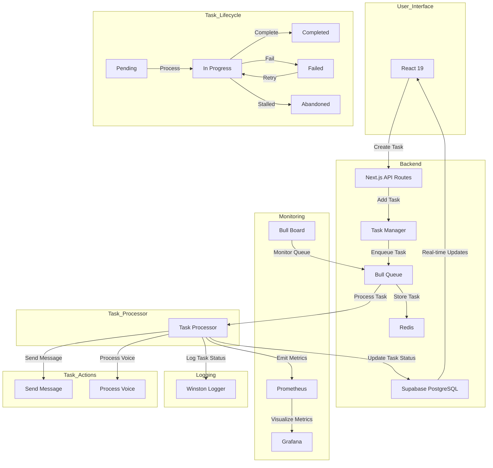

# Task Management System Specification

## Overview

This document outlines the requirements, choices, and plan of action for building a task management system using open-source and free solutions. The goal is to create a robust system that can handle both asynchronous and synchronous tasks, with real-time updates and persistence.

## Requirements

1. **Persistence**: Tasks should be persisted in a queue to ensure they are not lost even if the application crashes.
2. **Asynchronous Tasks**: Tasks should be executed concurrently.
3. **Synchronous Tasks**: High-priority tasks should be executed sequentially, one at a time.
4. **Real-time Updates**: The UI should receive real-time updates about task status.
5. **Monitoring and Debugging**: Tools should be in place to monitor and debug task execution.
6. **Failure Handling**: Implement retries, back pressure, and handling of abandoned tasks.

## Tech Stack

- **Next.js**: For the front-end and back-end.
- **React 19**: For building the UI.
- **Supabase**: For database and real-time subscriptions.
- **Bull**: For task queuing.
- **Redis**: For persisting tasks.
- **Prometheus and Grafana**: For monitoring and visualization.
- **Winston**: For logging.

## Diagram



### Explanation

1. **User Interface (React 19)**:
   - Responsible for creating tasks and displaying real-time updates.

2. **Backend (Next.js API Routes)**:
   - Handles API requests for task creation and monitoring.

3. **Task Manager**:
   - Manages the creation and processing of tasks.

4. **Bull Queue**:
   - Manages the queueing and processing of tasks using Redis.

5. **Redis**:
   - Stores tasks and their states in memory with persistence options.

6. **Supabase (PostgreSQL)**:
   - Stores task metadata, results, and errors. Provides real-time updates to the UI.

7. **Monitoring (Bull Board, Prometheus, Grafana)**:
   - Bull Board: Monitors and manages Bull queues.
   - Prometheus: Collects metrics from the application.
   - Grafana: Visualizes metrics collected by Prometheus.

8. **Logging (Winston)**:
   - Logs task status and errors.

9. **Task Lifecycle**:
   - Describes the possible states of a task: Pending, In Progress, Completed, Failed, and Abandoned.
   - Shows the transitions between states, including retries for failed tasks.

10. **Task Processor**:
    - Processes tasks based on their type.

11. **Task Actions (Send Message, Process Voice)**:
    - Specific actions that the task processor can perform.

### Workflow

1. **Task Creation**:
   - The user creates a task through the UI.
   - The UI sends a request to the Next.js API route to create the task.
   - The API route adds the task to the Bull queue.

2. **Task Queueing**:
   - The task is enqueued in the Bull queue and stored in Redis.
   - The task status is updated in Supabase.

3. **Task Processing**:
   - The task processor processes the task based on its type.
   - The task status is updated in Supabase.
   - Metrics are emitted to Prometheus.
   - Logs are written using Winston.

4. **Real-time Updates**:
   - Supabase provides real-time updates to the UI about the task status.

5. **Monitoring and Logging**:
   - Bull Board monitors the Bull queue.
   - Prometheus collects metrics, which are visualized in Grafana.
   - Winston logs task status and errors.

6. **Task Lifecycle**:
   - Tasks transition through various states: Pending, In Progress, Completed, Failed, and Abandoned.
   - Failed tasks can be retried.

This Mermaid diagram provides a visual representation of the components, their responsibilities, interactions, and the lifecycle of tasks in your task management system. It helps to understand the flow of tasks from creation to completion and the various states they can be in.

### Redis as a Queue Manager

**Redis** is primarily an in-memory data store, but it also offers persistence options. When used with Bull, Redis acts as the queue manager, storing tasks and their states. Redis supports two types of persistence:

1. **RDB (Redis Database Backup)**: Periodic snapshots of the dataset.
2. **AOF (Append-Only File)**: Logs every write operation received by the server.

These persistence mechanisms ensure that tasks are not lost even if the Redis server crashes. However, Redis is not designed to be a full-fledged relational database like PostgreSQL.

### Supabase for Persistent Storage

**Supabase** is built on top of PostgreSQL and provides a robust, scalable, and persistent storage solution. It is ideal for storing task metadata, results, and any other data that needs to be persisted long-term.

### Integration of Redis and Supabase

In your task management system, Redis (via Bull) will handle the queueing and processing of tasks, while Supabase will handle the persistent storage of task metadata, results, and any other relevant data.

### How It Works

1. **Task Creation**: When a task is created, it is added to the Redis queue managed by Bull.
2. **Task Processing**: Bull processes the task. During processing, the task status and any results or errors are updated in Supabase.
3. **Real-time Updates**: Supabase provides real-time updates to the UI, notifying it of changes in task status.

### Example Workflow

1. **Create a Task**:
   - Add the task to the Redis queue.
   - Insert the task metadata into the Supabase `tasks` table.

2. **Process the Task**:
   - Bull processes the task from the Redis queue.
   - Update the task status in the Supabase `tasks` table.
   - If the task is completed successfully, store the result in the Supabase `tasks` table.
   - If the task fails, store the error in the Supabase `tasks` table.

3. **Real-time Updates**:
   - The UI subscribes to real-time updates from Supabase.
   - When the task status changes, the UI is notified and updates accordingly.

### Schema for Tasks Table in Supabase

Here's an example schema for the `tasks` table in Supabase:

```sql
CREATE TABLE tasks (
  id SERIAL PRIMARY KEY,
  type VARCHAR(255) NOT NULL,
  payload JSONB NOT NULL,
  status VARCHAR(50) NOT NULL DEFAULT 'pending',
  result JSONB,
  error TEXT,
  created_at TIMESTAMPTZ DEFAULT NOW(),
  updated_at TIMESTAMPTZ DEFAULT NOW()
);
```

## Choices Made

### Task Queue

- **Bull**: Chosen for its maturity, robustness, and integration with Redis.

### Monitoring and Debugging

- **Bull Board**: For managing and monitoring Bull queues.
- **Prometheus and Grafana**: For collecting and visualizing metrics.
- **Winston**: For structured logging.

## Plan of Action

### 1. Set Up Bull Queue

#### Install Bull and Redis

```bash
npm install bull redis
```

#### Create Task Queue

Create a file `taskQueue.ts`:

```typescript
import Queue from 'bull';
import { createClient } from 'redis';

const redisClient = createClient({
  url: 'redis://localhost:6379', // Use your Redis config
});

const taskQueue = new Queue('task-queue', {
  createClient: (type) => {
    switch (type) {
      case 'client':
        return redisClient.duplicate();
      case 'subscriber':
        return redisClient.duplicate();
      case 'bclient':
        return redisClient.duplicate();
      default:
        return redisClient;
    }
  },
  defaultJobOptions: {
    attempts: 3,
    backoff: {
      type: 'exponential',
      delay: 1000,
    },
  },
});

export default taskQueue;
```

### 2. Define Task Processor

Create a file `taskProcessor.ts`:

```typescript
import { Job } from 'bull';
import { processVoice, sendMessage } from './taskActions'; // Import your task actions

type TaskData = {
  type: string;
  payload: any;
};

const taskProcessor = async (job: Job<TaskData>) => {
  switch (job.data.type) {
    case 'sendMessage':
      await sendMessage(job.data.payload);
      break;
    case 'processVoice':
      await processVoice(job.data.payload);
      break;
    // Add more task types here
    default:
      throw new Error(`Unknown task type: ${job.data.type}`);
  }
};

export default taskProcessor;
```

### 3. Create and Process Tasks

Create a file `taskManager.ts`:

```typescript
import taskQueue from './taskQueue';
import taskProcessor from './taskProcessor';

// Process tasks
taskQueue.process(taskProcessor, { concurrency: 5 });

// Create a task
const createTask = async (type: string, payload: any) => {
  await taskQueue.add({ type, payload });
};

export { createTask };
```

### 4. Integrate with Next.js API Routes

Create an API route `pages/api/tasks.ts`:

```typescript
import { NextApiRequest, NextApiResponse } from 'next';
import { createTask } from '../../taskManager';

export default async function handler(req: NextApiRequest, res: NextApiResponse) {
  if (req.method === 'POST') {
    const { type, payload } = req.body;
    await createTask(type, payload);
    res.status(200).json({ message: 'Task created' });
  } else {
    res.status(405).json({ message: 'Method not allowed' });
  }
}
```

### 5. Real-time Updates with Supabase

In your task processor, update the task status in Supabase and use real-time subscriptions to notify the UI:

```typescript
import { Job } from 'bull';
import { supabase } from './supabaseClient'; // Import your Supabase client
import { processVoice, sendMessage } from './taskActions'; // Import your task actions

type TaskData = {
  type: string;
  payload: any;
};

const taskProcessor = async (job: Job<TaskData>) => {
  try {
    switch (job.data.type) {
      case 'sendMessage':
        await sendMessage(job.data.payload);
        break;
      case 'processVoice':
        await processVoice(job.data.payload);
        break;
      // Add more task types here
      default:
        throw new Error(`Unknown task type: ${job.data.type}`);
    }

    // Update task status in Supabase
    await supabase
      .from('tasks')
      .update({ status: 'completed' })
      .eq('id', job.id);
  } catch (error) {
    // Handle error and update task status
    await supabase
      .from('tasks')
      .update({ status: 'failed', error: error.message })
      .eq('id', job.id);
  }
};

export default taskProcessor;
```

### 6. Set Up Bull Board

#### Install Bull Board

```bash
npm install bull-board
```

#### Create Bull Board UI

Create a file `bullBoard.ts`:

```typescript
import { createBullBoard } from 'bull-board';
import { BullAdapter } from 'bull-board/bullAdapter';
import taskQueue from './taskQueue'; // Import your task queue

const { router, setQueues, replaceQueues } = createBullBoard([
  new BullAdapter(taskQueue),
]);

export { router, setQueues, replaceQueues };
```

#### Integrate Bull Board with Next.js

Create an API route `pages/api/bull-board.ts`:

```typescript
import { NextApiRequest, NextApiResponse } from 'next';
import { router } from '../../bullBoard';

export default function handler(req: NextApiRequest, res: NextApiResponse) {
  router(req, res);
}
```

### 7. Set Up Prometheus and Grafana

#### Install Prometheus Client

```bash
npm install prom-client
```

#### Set Up Metrics Collection

Create a file `metrics.ts`:

```typescript
import { register, collectDefaultMetrics } from 'prom-client';
import taskQueue from './taskQueue'; // Import your task queue

collectDefaultMetrics();

taskQueue.on('completed', (job) => {
  const completedJobs = register.getSingleMetric('completed_jobs') || new register.Counter({
    name: 'completed_jobs',
    help: 'Number of completed jobs',
  });
  completedJobs.inc();
});

taskQueue.on('failed', (job) => {
  const failedJobs = register.getSingleMetric('failed_jobs') || new register.Counter({
    name: 'failed_jobs',
    help: 'Number of failed jobs',
  });
  failedJobs.inc();
});

export const metrics = () => register.metrics();
```

#### Create an API Route for Metrics

Create a file `pages/api/metrics.ts`:

```typescript
import { NextApiRequest, NextApiResponse } from 'next';
import { metrics } from '../../metrics';

export default function handler(req: NextApiRequest, res: NextApiResponse) {
  res.setHeader('Content-Type', register.contentType);
  res.end(metrics());
}
```

### 8. Set Up Logging with Winston

#### Install Winston

```bash
npm install winston
```

#### Configure Winston

Create a file `logger.ts`:

```typescript
import winston from 'winston';

const logger = winston.createLogger({
  level: 'info',
  format: winston.format.json(),
  transports: [
    new winston.transports.Console(),
    new winston.transports.File({ filename: 'error.log', level: 'error' }),
    new winston.transports.File({ filename: 'combined.log' }),
  ],
});

export default logger;
```

#### Integrate Winston with Your Application

```typescript
import logger from './logger';

taskQueue.on('completed', (job) => {
  logger.info(`Job completed: ${job.id}`);
});

taskQueue.on('failed', (job, err) => {
  logger.error(`Job failed: ${job.id}`, { error: err.message });
});
```

### 9. Handle Abandoned Tasks

```typescript
taskQueue.on('stalled', (job) => {
  console.log(`Job ${job.id} is stalled`);
  // Handle stalled job (e.g., retry or log)
});
```

## Next Steps

1. **Implement the Task Queue**: Set up Bull and Redis for task queuing.
2. **Define Task Processors**: Create functions to handle different types of tasks.
3. **Create and Process Tasks**: Implement the task creation and processing logic.
4. **Integrate with Next.js**: Create API routes to handle task creation and monitoring.
5. **Set Up Real-time Updates**: Use Supabase for real-time updates and persistence.
6. **Set Up Bull Board**: Integrate Bull Board for managing and monitoring tasks.
7. **Set Up Prometheus and Grafana**: Collect and visualize metrics.
8. **Set Up Logging with Winston**: Implement structured logging.
9. **Handle Abandoned Tasks**: Implement logic to handle stalled jobs.

By following this plan, you can build a robust and scalable task management system using open-source and free solutions. This will help you validate your idea and lay the foundation for implementing more complex workflows and plans in the future.

# Future Enhancements

## Testing Strategy for Task Management System
This document outlines the testing approach for the local task management system, covering unit tests, integration tests, and end-to-end tests. The strategy focuses on local testing and detecting regressions.

## Testing Tools

### Core Testing Framework
- **Jest**: Primary testing framework
- **Testing Library**: For React component testing
- **Supertest**: For API endpoint testing
- **Bull Testing Tools**: For queue testing
- **Mock Service Worker (MSW)**: For API mocking
- **Docker Compose**: For local testing environment

### Test Types

#### 1. Unit Tests
Tools: Jest + Testing Library
- Test individual components and functions
- Mock external dependencies
- Focus on business logic

#### 2. Integration Tests
Tools: Jest + Supertest
- Test API routes
- Test database operations
- Test queue operations

#### 3. End-to-End Tests
Tools: Playwright
- Test complete workflows
- Test UI interactions
- Test real-time updates

## Testing Environment Setup

### Local Testing Environment
```yaml
version: '3.8'
services:
  redis:
    image: redis:alpine
    ports:
      - "6379:6379"
    volumes:
      - redis_data:/data

  postgres:
    image: postgres:13
    ports:
      - "5432:5432"
    environment:
      POSTGRES_USER: postgres
      POSTGRES_PASSWORD: postgres
      POSTGRES_DB: taskmanagement_test
    volumes:
      - postgres_data:/var/lib/postgresql/data

volumes:
  redis_data:
  postgres_data:
```

## Test Implementation Examples

### 1. Unit Tests

#### Task Queue Tests
```typescript
import Bull from 'bull';
import { createTask } from '../src/taskManager';
import { taskProcessor } from '../src/taskProcessor';

describe('Task Queue', () => {
  let queue: Bull.Queue;

  beforeEach(() => {
    queue = new Bull('test-queue', {
      redis: { port: 6379, host: 'localhost' }
    });
  });

  afterEach(async () => {
    await queue.empty();
    await queue.close();
  });

  test('should process task successfully', async () => {
    const task = { type: 'sendMessage', payload: { message: 'test' } };
    await createTask(task.type, task.payload);
    
    const job = await queue.add(task);
    const result = await taskProcessor(job);
    
    expect(result).toBeDefined();
    expect(job.data).toEqual(task);
  });
});
```

#### React Component Tests
```typescript
import { render, screen, fireEvent } from '@testing-library/react';
import { TaskCreator } from '../src/components/TaskCreator';

describe('TaskCreator', () => {
  test('creates new task when form is submitted', async () => {
    const onSubmit = jest.fn();
    render(<TaskCreator onSubmit={onSubmit} />);

    fireEvent.change(screen.getByLabelText('Task Type'), {
      target: { value: 'sendMessage' }
    });

    fireEvent.click(screen.getByText('Create Task'));
    
    expect(onSubmit).toHaveBeenCalledWith({
      type: 'sendMessage',
      payload: expect.any(Object)
    });
  });
});
```

### 2. Integration Tests

#### API Route Tests
```typescript
import request from 'supertest';
import { createServer } from '../src/server';
import { taskQueue } from '../src/taskQueue';

describe('Task API', () => {
  const app = createServer();

  beforeEach(async () => {
    await taskQueue.empty();
  });

  test('POST /api/tasks creates new task', async () => {
    const response = await request(app)
      .post('/api/tasks')
      .send({
        type: 'sendMessage',
        payload: { message: 'test' }
      });

    expect(response.status).toBe(200);
    expect(response.body).toHaveProperty('message', 'Task created');
    
    const jobs = await taskQueue.getJobs(['waiting']);
    expect(jobs).toHaveLength(1);
  });
});
```

### 3. End-to-End Tests

```typescript
import { test, expect } from '@playwright/test';

test('complete task workflow', async ({ page }) => {
  await page.goto('http://localhost:3000');

  // Create new task
  await page.click('button[data-testid="create-task"]');
  await page.fill('input[name="taskType"]', 'sendMessage');
  await page.fill('textarea[name="payload"]', '{"message": "test"}');
  await page.click('button[type="submit"]');

  // Wait for real-time updates
  await expect(page.locator('[data-testid="task-status"]'))
    .toHaveText('completed', { timeout: 5000 });

  // Check task details
  await page.click('[data-testid="task-details"]');
  await expect(page.locator('[data-testid="task-result"]'))
    .toBeVisible();
});
```

## Test Coverage Requirements

- Unit Tests: Minimum 80% coverage
- Integration Tests: All API endpoints and critical paths
- E2E Tests: All main user workflows

## Continuous Testing Strategy

### Pre-commit Hooks
```json
{
  "husky": {
    "hooks": {
      "pre-commit": "npm run lint && npm run test:unit",
      "pre-push": "npm run test:integration"
    }
  }
}
```

### Test Scripts
```json
{
  "scripts": {
    "test": "jest",
    "test:unit": "jest --testPathPattern=unit",
    "test:integration": "jest --testPathPattern=integration",
    "test:e2e": "playwright test",
    "test:coverage": "jest --coverage",
    "test:watch": "jest --watch"
  }
}
```

## Regression Testing Strategy

1. **Snapshot Testing**
   - Create snapshots of critical component renders
   - Create snapshots of API responses
   - Regular snapshot updates with version control

2. **Performance Regression**
   - Track task processing times
   - Monitor queue lengths
   - Test concurrent task handling

3. **Visual Regression**
   - Use Playwright's screenshot comparison
   - Track UI changes across updates

## Monitoring Test Results

1. **Jest Output**
   - Console output for quick feedback
   - HTML reports for detailed analysis

2. **Playwright Report**
   - Visual test results
   - Performance metrics
   - Screenshots and videos

3. **Coverage Reports**
   - HTML coverage reports
   - Branch coverage analysis
   - Uncovered code identification

## Best Practices

1. **Test Independence**
   - Each test should be self-contained
   - Clean up test data after each test
   - Use unique identifiers for test data

2. **Test Environment**
   - Use separate database for testing
   - Reset Redis between tests
   - Mock external services

3. **Test Data Management**
   - Use factories for test data
   - Maintain fixtures in version control
   - Clear test data between runs

## Setting Up the Test Environment

1. Install dependencies:
```bash
npm install --save-dev jest @testing-library/react @testing-library/jest-dom supertest @playwright/test msw
```

2. Create Jest configuration:
```javascript
// jest.config.js
module.exports = {
  testEnvironment: 'jsdom',
  setupFilesAfterEnv: ['<rootDir>/jest.setup.js'],
  testPathIgnorePatterns: ['<rootDir>/.next/', '<rootDir>/node_modules/'],
  moduleNameMapper: {
    '^@/components/(.*)$': '<rootDir>/components/$1',
    '^@/lib/(.*)$': '<rootDir>/lib/$1'
  }
};
```

3. Configure Playwright:
```javascript
// playwright.config.ts
import { PlaywrightTestConfig } from '@playwright/test';

const config: PlaywrightTestConfig = {
  testDir: './e2e',
  use: {
    baseURL: 'http://localhost:3000',
    trace: 'on-first-retry',
  },
  webServer: {
    command: 'npm run dev',
    port: 3000,
    timeout: 120 * 1000,
    reuseExistingServer: !process.env.CI,
  },
};

export default config;
```
