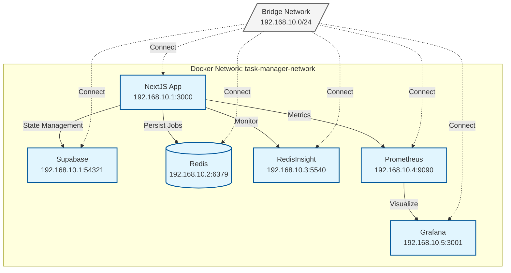
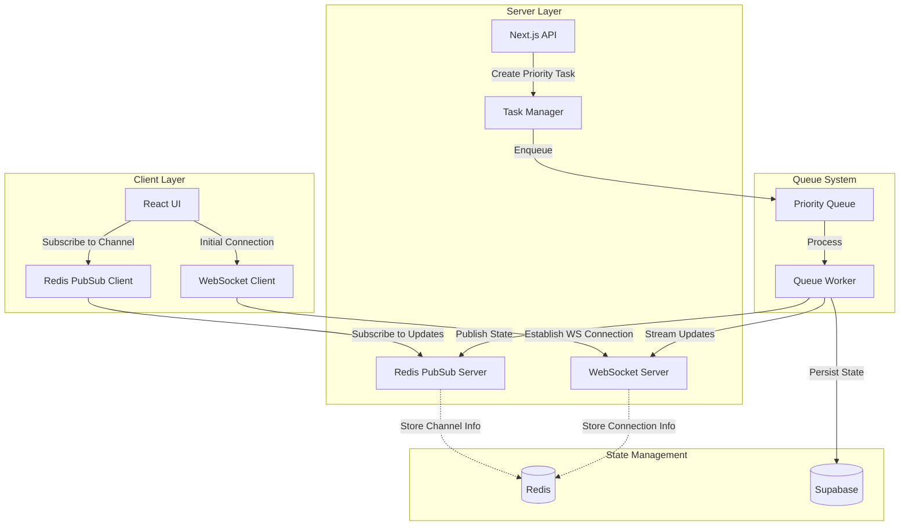

# Updated Task Management System Specification

## System Overview

The task management system is a distributed application designed to handle various types of tasks with different processing requirements, including real-time streaming capabilities and priority processing for LLM tasks.

## System Architecture

```mermaid
graph TD
    subgraph "Client Layer"
        UI[React UI]
        ClientWS[WebSocket Client]
    end
    subgraph "Server Layer"
        API[Next.js API Routes]
        ServerActions[Server Actions]
        WSServer[WebSocket Server]
        StreamHandler[Stream Handler]
    end
    subgraph "Queue System"
        BullMQ[Bull MQ]
        Worker[Worker]
        BullBoard[Bull Dashboard]
        EventBus[Event Bus]
    end
    subgraph "Storage & State"
        Redis[(Redis)]
        RedisInsight[Redis Insight]
        Supabase[(Supabase)]
    end
    subgraph "Monitoring"
        Prometheus[Prometheus]
        Grafana[Grafana]
    end
    subgraph "Queue Types"
        StandardQueue[Standard Queue]
        StreamingQueue[Streaming Queue]
        PriorityQueue[Priority Queue]
    end
    %% Client Connections
    UI -->|HTTP| API
    UI -->|WebSocket| ClientWS
    UI -->|Real-time Subscribe| Supabase
    %% Server Layer
    API -->|Enqueue| BullMQ
    ServerActions -->|Enqueue| BullMQ
    ClientWS -->|Stream| WSServer
    WSServer -->|Handle Stream| StreamHandler
    %% Queue System
    BullMQ -->|Process Jobs| Worker
    Worker -->|Execute| StandardQueue
    Worker -->|Execute| StreamingQueue
    Worker -->|Execute| PriorityQueue
    Worker -->|Update State| Supabase
    BullBoard -->|Monitor| BullMQ
    %% Storage & State
    BullMQ -.->|Store Jobs| Redis
    Redis -.->|Monitor| RedisInsight
    %% Event System
    EventBus -->|Job Events| Worker
    Worker -->|Publish Events| EventBus
    EventBus -->|State Changes| Supabase
    EventBus -->|Queue Updates| BullMQ
    Redis -->|Persistence Events| EventBus
    %% Monitoring
    Worker -->|Metrics| Prometheus
    Prometheus -->|Visualize| Grafana
    %% Streaming
    StreamHandler -->|Priority Process| PriorityQueue
    StreamingQueue -->|Real-time Data| WSServer
    PriorityQueue -->|Real-time Response| WSServer
  ```


```mermaid
graph TD
    %% Client Layer
    subgraph ClientLayer["Client Layer"]
        UI["React UI"]
        StateManager["Client State Manager"]
    end

    %% Communication Layer
    subgraph CommLayer["Communication Layer"]
        WSClient["WebSocket Client"]
        RTChannel["Real-time Channels"]
        EventStream["Event Stream Handler"]
    end

    %% Server Layer
    subgraph ServerLayer["Server Layer"]
        API["API Routes"]
        WSServer["WebSocket Server"]
        ServerActions["Server Actions"]
    end

    %% Queue Management System
    subgraph QueueSystem["Queue Management System"]
        direction TB
        TaskManager["Task Manager"]
        subgraph Queues["Queue Types"]
            StandardQ["Standard Queue"]
            PriorityQ["Priority Queue"]
            StreamQ["Stream Queue"]
        end
        subgraph Workers["Workers"]
            JobWorker["Job Worker"]
            StreamWorker["Stream Worker"]
        end
        JobProcessor["Job Processor"]
        EventBus["Event Bus"]
    end

    %% State & Storage
    subgraph StateStorage["State & Storage"]
        Redis[(Redis)]
        DB[(Database)]
        StateObserver["State Observer"]
    end

    %% Communication Patterns
    UI -->|"HTTP/REST"| API
    UI -->|"WebSocket"| WSClient
    StateManager -->|"State Subscribe"| DB

    %% Real-time Communication
    WSClient -->|"WebSocket"| WSServer
    WSServer -->|"Stream"| EventStream
    RTChannel -->|"Bi-directional"| WSServer

    %% Server Processing
    API -->|"Create Job"| TaskManager
    ServerActions -->|"Dispatch"| TaskManager

    %% Queue System Flow
    TaskManager -->|"Enqueue"| Queues
    Queues -->|"Process"| Workers
    Workers -->|"Execute"| JobProcessor
    JobProcessor -->|"Emit Events"| EventBus

    %% State Management
    EventBus -->|"State Events"| StateObserver
    StateObserver -->|"Update"| DB
    Redis -->|"Cache Events"| EventBus

    %% Stream Processing
    StreamWorker -->|"Real-time Data"| RTChannel
    EventStream -->|"Priority Tasks"| PriorityQ

    %% Style Definitions
    classDef default fill:#f9f9f9,stroke:#333,stroke-width:1px
    classDef storage fill:#f4f4f4,stroke:#666,stroke-width:2px
    classDef important fill:#e1f5fe,stroke:#0288d1,stroke-width:2px

    class Redis,DB storage
    class EventBus,TaskManager important

```


## Core Components

### 1. Client Layer
- **React UI**: Main user interface
- **WebSocket Client**: Handles real-time streaming connections
- **Supabase Subscriptions**: Real-time updates for task status

### 2. Server Layer
- **Next.js API Routes**: HTTP endpoints for task creation
- **Server Actions**: Direct server-side task creation
- **WebSocket Server**: Handles streaming connections
- **Stream Handler**: Manages streaming task processing

### 3. Queue System
- **Bull MQ**: Main queuing system
- **Worker**: Processes jobs from queues
  - Subscribes to queue events
  - Updates task state in Supabase
  - Emits metrics
- **Queue Types**:
  - Standard Queue: Regular tasks
  - Streaming Queue: Real-time data streaming tasks
  - Priority Queue: LLM and high-priority tasks

### 4. Storage & State
- **Redis**: Job storage and queue management
- **Redis Insight**: Queue monitoring and debugging
- **Supabase**: 
  - Task metadata persistence
  - Real-time state updates
  - Client subscriptions

### 5. Monitoring
- **Bull Board**: Queue visualization
- **Prometheus**: Metrics collection
- **Grafana**: Metrics visualization

## Task Processing Flow

1. **Task Creation**
```typescript
// Via API Route
async function createTask(req: NextApiRequest, res: NextApiResponse) {
  const queue = new Queue('taskQueue');
  await queue.add('taskName', data);
}

// Via Server Action
async function serverActionCreateTask(data: TaskData) {
  const queue = new Queue('taskQueue');
  await queue.add('taskName', data);
}
```

2. **Worker Processing**
```typescript
// Worker setup
const worker = new Worker('taskQueue', async job => {
  try {
    // Process job
    const result = await processJob(job.data);
      
    return result;
  } catch (error) {
    // Handle error and update state
     
    throw error;
  }
});

// Subscribe to events
worker.on('completed', handleComplete);
worker.on('failed', handleFailed);
worker.on('progress', handleProgress);
```

3. **Streaming Tasks**
```typescript
// Streaming worker
const streamingWorker = new Worker('streamingQueue', async (job, ws) => {
  const stream = new StreamHandler(ws);
  
  try {
    await processStreamingJob(job.data, stream);
  } finally {
    stream.close();
  }
});
```

## Database Schema

```sql
CREATE TABLE tasks (
  id UUID DEFAULT uuid_generate_v4() PRIMARY KEY,
  type VARCHAR(50) NOT NULL,
  status VARCHAR(20) NOT NULL DEFAULT 'pending',
  data JSONB NOT NULL,
  result JSONB,
  error TEXT,
  created_at TIMESTAMPTZ DEFAULT NOW(),
  updated_at TIMESTAMPTZ DEFAULT NOW(),
  started_at TIMESTAMPTZ,
  completed_at TIMESTAMPTZ
);

-- Realtime enable
ALTER PUBLICATION supabase_realtime ADD TABLE tasks;
```

## Task Manager Containterized Architecture



## Docker Network Configuration

The system uses a dedicated Docker network with fixed IP assignments:
- Network: 192.168.10.0/24
- NextJS App: 192.168.10.1:3000
- Redis: 192.168.10.2:6379
- RedisInsight: 192.168.10.3:5540
- Prometheus: 192.168.10.4:9090
- Grafana: 192.168.10.5:3001

## Monitoring & Metrics

1. **Worker Metrics**
```typescript
const metrics = new Metrics();

worker.on('completed', () => metrics.jobsCompleted.inc());
worker.on('failed', () => metrics.jobsFailed.inc());
worker.on('progress', () => metrics.jobsProgress.observe());
```

2. **Queue Metrics**
- Active jobs
- Completed jobs
- Failed jobs
- Queue length
- Processing time
- Wait time

## Real-time Updates

1. **Supabase Subscriptions**
```typescript
// Client-side subscription
const subscription = supabase
  .from('tasks')
  .on('UPDATE', payload => {
    updateUI(payload.new);
  })
  .subscribe();
```

2. **WebSocket Streaming**




```typescript
// Types
interface StreamingTask {
  id: string;
  channelId: string;
  wsConnectionId: string;
  priority: number;
  data: any;
}

// Redis PubSub Setup
import { Redis } from 'ioredis';
const publisher = new Redis();
const subscriber = new Redis();

// WebSocket Manager
class WebSocketManager {
  private connections = new Map<string, WebSocket>();
  
  addConnection(id: string, ws: WebSocket) {
    this.connections.set(id, ws);
    // Store connection ID in Redis for other workers
    await redis.hset('ws:connections', id, Date.now());
  }
  
  removeConnection(id: string) {
    this.connections.delete(id);
    await redis.hdel('ws:connections', id);
  }
  
  getConnection(id: string) {
    return this.connections.get(id);
  }
}

// Task Manager
class PriorityTaskManager {
  constructor(
    private wsManager: WebSocketManager,
    private queue: Queue
  ) {}

  async createStreamingTask(task: StreamingTask) {
    // Create a unique channel for this task
    const channelId = `task:${task.id}`;
    
    // Add task to priority queue
    await this.queue.add('streamingTask', {
      ...task,
      channelId
    }, {
      priority: task.priority
    });

    // Subscribe to task channel
    subscriber.subscribe(channelId, (err, count) => {
      if (err) console.error('Failed to subscribe:', err);
    });

    // Handle incoming updates
    subscriber.on('message', (channel, message) => {
      if (channel === channelId) {
        const ws = this.wsManager.getConnection(task.wsConnectionId);
        if (ws) {
          ws.send(message);
        }
      }
    });

    return channelId;
  }
}

// Queue Worker
const worker = new Worker('streamingQueue', async job => {
  const { channelId, data } = job.data;
  
  try {
    // Process streaming task
    for await (const chunk of processStreamingData(data)) {
      // Publish updates to task-specific channel
      await publisher.publish(channelId, JSON.stringify({
        type: 'chunk',
        data: chunk
      }));
      
      // Update task state in Supabase
      await supabase
        .from('tasks')
        .update({ 
          lastChunk: chunk,
          updatedAt: new Date()
        })
        .eq('id', job.data.id);
    }
    
    // Send completion message
    await publisher.publish(channelId, JSON.stringify({
      type: 'complete'
    }));
    
  } catch (error) {
    // Publish error to channel
    await publisher.publish(channelId, JSON.stringify({
      type: 'error',
      error: error.message
    }));
  }
});

// React Client Component
const StreamingTaskComponent = ({ taskId }) => {
  const [messages, setMessages] = useState([]);
  const ws = useWebSocket();
  const pubSub = usePubSub();

  useEffect(() => {
    // Subscribe to task-specific channel
    const channelId = `task:${taskId}`;
    const subscription = pubSub.subscribe(channelId, message => {
      setMessages(prev => [...prev, message]);
    });

    return () => {
      subscription.unsubscribe();
    };
  }, [taskId]);

  return (
    <div>
      {messages.map((msg, i) => (
        <div key={i}>{msg.data}</div>
      ))}
    </div>
  );
};

```

Based on your system architecture, I've designed a solution that combines WebSocket streaming with Redis Pub/Sub for priority task communication. Here's how it works:

1. **Dual Communication Channels:**
   - WebSocket for direct streaming of task data
   - Redis Pub/Sub for task state and control messages

2. **Task-Specific Channels:**
   - Each priority streaming task gets a unique Redis channel
   - Allows for isolated communication per task
   - Makes it easy to manage subscriptions and cleanup

3. **Key Components:**
   - WebSocket Manager: Handles WS connections and maintains connection state in Redis
   - Priority Task Manager: Creates tasks and sets up communication channels
   - Queue Worker: Processes tasks and publishes updates to appropriate channels

4. **Flow:**
   1. Client connects via WebSocket and gets a connection ID
   2. When creating a priority streaming task, a unique channel is created
   3. Client subscribes to the task's channel
   4. Worker processes the task and publishes updates to both WS and Pub/Sub
   5. UI receives updates through both channels and merges them

The benefits of this approach are:
- Scalable: Multiple workers can handle different tasks
- Resilient: Redis Pub/Sub provides reliable message delivery
- Efficient: Task-specific channels prevent message broadcasting
- Maintainable: Clear separation between streaming data and control messages

```typescript
// Server-side
const ws = new WebSocket.Server({ port });
ws.on('connection', socket => {
  socket.on('message', handleStreamMessage);
});

// Client-side
const ws = new WebSocket(`ws://localhost:${port}`);
ws.onmessage = event => {
  updateStreamUI(event.data);
};
```

## Error Handling & Resilience

1. **Queue Retry Configuration**
```typescript
const queue = new Queue('taskQueue', {
  defaultJobOptions: {
    attempts: 3,
    backoff: {
      type: 'exponential',
      delay: 1000
    }
  }
});
```

2. **Worker Error Handling**
```typescript
worker.on('failed', async (job, err) => {
  await supabase
    .from('tasks')
    .update({
      status: 'failed',
      error: err.message,
      retries: job.attemptsMade
    })
    .eq('id', job.id);
});
```

This updated specification reflects the decoupled architecture with proper separation of concerns and resilient handling of various task types and processing requirements.